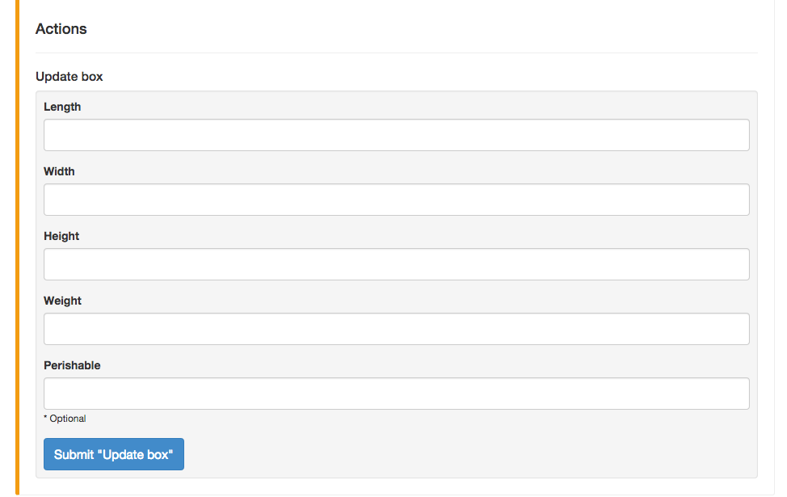

# Upmin

Upmin is a framework for creating powerful admin backends with minimal effort.


## Demo

To see a demo of Upmin, go to [https://www.upmin.com/demo](https://www.upmin.com/demo).

You should probably just install Upmin rather than using the demo. It only takes a few lines of code you will be able to use your own data, rather than fake data provided be me.


## Installation

Installing Upmin is incredibly easy. Simple add the gem to your `Gemfile`:

```ruby
gem 'upmin'
```

And then mount the engine in your `routes.rb` file:

```ruby
mount Upmin::Engine => '/admin'
```

Authentication is currently supported with an existing Devise install. Simply use something like this:

```ruby
authenticate :user, lambda { |u| u.admin? } do
  mount Upmin::Engine => '/admin'
end
```

### Adding Actions

One of the sweetest features to add right away are actions, so here is a quick rundown on how to do that.

First, you need to declare which methods you want to show up on admin pages as actions. You do this by adding `upmin_actions` to your model file like so:

```ruby
class Shipment < ActiveRecord::Base
  belongs_to :order

  upmin_actions :update_box

  def update_box(length, width, height, weight, perishable = false)
    # Make sure args are cast correctly
    length = length.to_i
    widht = width.to_i
    height = height.to_i
    weight = weight.to_f
    perishable = ["yes", "true"].include?(perishable.downcase)

    # Fake work ...
    raise "Invalid weight: #{weight}" if weight <= 0
    raise "Perishable shipments require a manual order with <xxxxx>" if perishable

    if length > width && length > height
      return "Larger length!"
    elsif width > length && width > height
      return "Larger width!"
    else
      return "Larger height!"
    end

  end
end

```

From here you just need to go to the view for one of these models and you should see the actions. For example, the above code creates the following:



And that's it. You should have a working action. The only thing to keep in mind is that Upmin does not currently do case conversions for you. That will be coming in a future release.

## Features

Upmin makes it easy to build and iterate on admin pages in a few ways. To begin with, it supports all of the standard features you are used to seeing in admin frameworks. For example, you can:

- Search & Filter
- View & Edit Models
- Require User Authentication

While these features are great, they have pretty much become the norm and aren't worth talking about much. The following features are what seperates Upmin from other admin frameworks:


### Customizable and Reusable Views

Upmin doesn't force you to learn Arbre or any other obscure DSL. Simply use the tools you are used to, whether that is haml or erb, and customize your views.

You can even embed javascript via the Rails [content_for](http://api.rubyonrails.org/classes/ActionView/Helpers/CaptureHelper.html#method-i-content_for) helper. For example, the DateTime attribute shown [here](https://db.tt/0IHCE330) and [here](https://db.tt/7auKD5nB) is rendered using a reusable partial that provides both the html and javascript using a HAML file.

Over time Upmin will be releasing a wide array of reusable views ranging from geo-cordinate maps to shipment tracking widgets.


### Model Actions

I often find myself wanting to add pretty basic funcionality to my admin pages, and getting frustrated at how much work this can take. Even something as simple as changing the box size for a shipment requires a custom form. Upmin solves this by inspecting methods and simply generating forms for any action you define as an upmin action.

For example, if you wanted to add the method `set_box_size` to your `Shipment` model the code would look something like this:

```ruby
class Shipment < ActiveRecord::Base
  ...

  upmin_action :set_box_size

  def set_box_size(length, width, height)
    # Do work here
  end

  ...
end
```

And Upmin would generate fully functional forms for you that look (roughly) like this: [https://db.tt/JhzdeS8Z](https://db.tt/JhzdeS8Z)


## Going Forward

There are a lot of things that need built going forward and we are looking for anyone who wants to get involved. Just hop in our hipchat (link below) or email us (link also below).

The major features that are being worked on now are:

1. DataMapper support
2. Fixing bugs - specifically ones like ActsAsTaggable causing the menu to have far too many models.
3. Implementing the Dashboard
4. Adding useful widgets, such as an EasyPost Tracking label widget, a Stripe Card widget, and other commonly used APIs, as well as Map widgets for plotting routes or just showing a location.


## Support/Feedback

The goal of Upmin is to make it easier to build admin pages with minimal effort. With that in mind, we are always looking for feedback and suggestions. You can get in touch several ways.

Email - [support@upmin.com](support@upmin.com)

Chat - [http://www.hipchat.com/gvREostp6](http://www.hipchat.com/gvREostp6)

